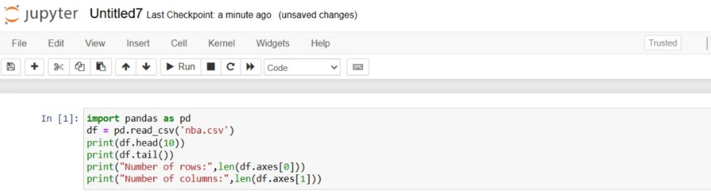
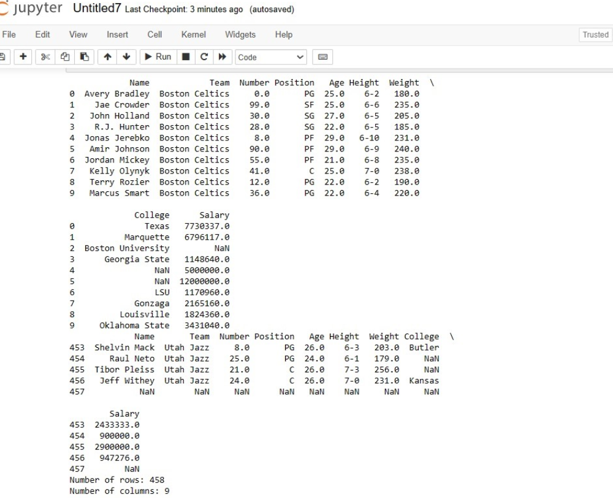

# Read-from-CSV

## AIM:
To write a python program for copying the contents from one file to another file.

## ALGORITHM:
### Step 1:
start the program
### Step 2:
import pandas 
### Step 3:
 star to find the reading content of csv.file
### Step 4:
end the program


## PROGRAM:
```
'''
Developed by: 
Register No: 2122232400136
'''
To write a python program for reading content from a CSV file.
import pandas as pd
df = pd.read_csv('nba.csv')
print(df.head(10))
print(df.tail())
print("Number of rows:",len(df.axes[0]))
print("Number of columns:",len(df.axes[1]))
```
## OUTPUT:




## RESULT:
Thus the progam has been completed sucessfully